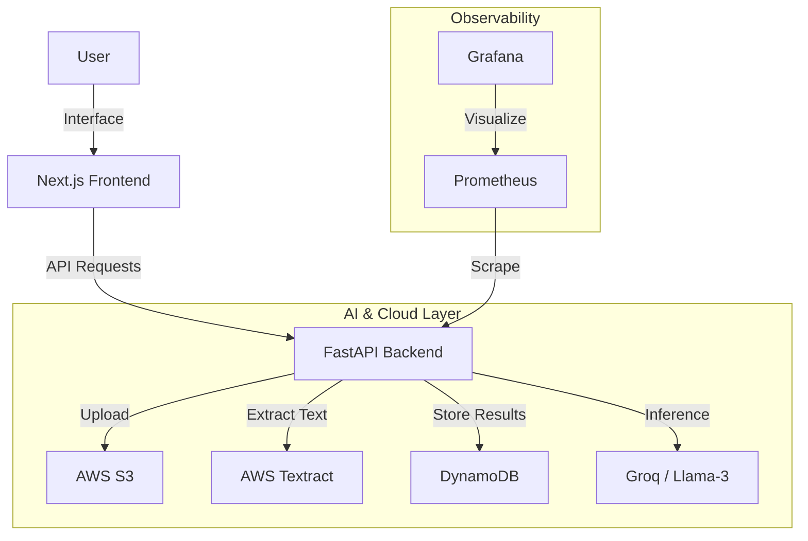

# DocuShield 🛡️
### Production-Grade AI Contract Analysis Platform

**DocuShield** is a robust, hybrid AI system designed to analyze legal contracts with enterprise-grade reliability. It moves beyond simple "chat with PDF" demos by engineering a fault-tolerant system around probabilistic AI components.

Built with **Next.js**, **FastAPI**, and **AWS**, it orchestrates managed cloud services (Textract, S3, DynamoDB) alongside high-performance LLM inference (Groq) to deliver deterministic risk analysis and clause-level reasoning.

---

## 🚀 Key Features

*   **📄 Enterprise OCR & Layout Preservation**: Uses **AWS Textract** to accurately extract text, forms, and tables from complex legal PDFs, outperforming standard Python libraries.
*   **🤖 Hybrid AI Analysis**: Leverages **Groq (Llama-3)** for ultra-fast, reasoning-heavy risk assessment, identifying dangerous clauses and assigning risk scores (0-100).
*   **💬 RAG-Powered Contract Chat**: interactive Q&A capability grounded in the actual contract text using vector embeddings, preventing hallucinations.
*   **🔒 Secure Cloud Storage**: Implements a separation of concerns with **AWS S3** for immutable document storage and **DynamoDB** for operational headers and audit results.
*   **📊 Observability First**: Built-in monitoring stack with **Prometheus** and **Grafana** to track API latency, error rates, and system throughput.
*   **🐳 Containerized Architecture**: Fully Dockerized environments for both frontend and backend, ensuring consistent deployment across local and cloud setups.

---

## 🛠️ Technology Stack

### **Frontend** (Modern & Responsive)
*   **Framework**: Next.js 14 (React)
*   **Styling**: Tailwind CSS, Lucide Icons
*   **Language**: TypeScript

### **Backend** (High-Performance Orchestration)
*   **Framework**: FastAPI (Python)
*   **Process**: Asynchronous task management for long-running OCR jobs
*   **Validation**: Pydantic models for strict data schemas

### **AI & Cloud Services**
*   **OCR**: AWS Textract
*   **LLM Inference**: Groq API (Llama-3-70b)
*   **Storage**: AWS S3 (Documents), AWS DynamoDB (Metadata)
*   **Vector Search**: FAISS (Local embeddings for RAG)

### **Infrastructure & DevOps**
*   **Containerization**: Docker & Docker Compose
*   **IaC**: Terraform (Infrastructure provisioning)
*   **Monitoring**: Prometheus (Metrics), Grafana (Visualization)

---

## 🏗️ Architecture Overview

The system follows a microservices-based architecture where the frontend and backend are decoupled, communicating via REST APIs.



---

## ⚡ Getting Started

### Prerequisites
*   **Docker & Docker Compose** installed
*   **AWS Credentials** (Access Key & Secret) with permissions for S3, Textract, and DynamoDB
*   **Groq API Key** for LLM access

### 1. Clone the Repository
```bash
git clone https://github.com/SaadBrohi/DocuShield.git
cd DocuShield
```

### 2. Configure Environment Variables
Create a `.env` file in the root directory:

```ini
# AI / LLM
GROQ_API_KEY=your_groq_api_key

# AWS Credentials
AWS_ACCESS_KEY_ID=your_aws_access_key
AWS_SECRET_ACCESS_KEY=your_aws_secret_key
AWS_REGION=us-east-1

# Infrastructure
S3_BUCKET_NAME=your_s3_bucket_name
DYNAMODB_TABLE_NAME=your_dynamodb_table_name
```

### 3. Run with Docker
The entire system (Frontend, Backend, Prometheus, Grafana) can be spun up with a single command:

```bash
docker-compose up --build
```

### 4. Access the Application
*   **Web App**: [http://localhost:3000](http://localhost:3000)
*   **API Documentation**: [http://localhost:8000/docs](http://localhost:8000/docs)
*   **Grafana Dashboards**: [http://localhost:3001](http://localhost:3001) (Default login: `admin`/`admin`)
*   **Prometheus**: [http://localhost:9090](http://localhost:9090)

---

## 📂 Project Structure

```
DocuShield/
├── frontend/             # Next.js Application
│   ├── app/              # App Router Pages
│   ├── components/       # Reusable UI Components
│   └── public/           # Static Assets
├── src/
│   └── backend/          # FastAPI Application
│       ├── routers/      # API Endpoints
│       ├── services/     # AWS & AI Service Integrations
│       ├── models/       # Pydantic Schemas
│       └── main.py       # App Entrypoint
├── infra/                # Infrastructure Configuration
│   ├── main.tf           # Terraform Configuration
│   └── prometheus.yml    # Monitoring Config
├── docker-compose.yml    # Container Orchestration
└── README.md             # You are here
```

---

## 📜 License
This project is licensed under the MIT License.
